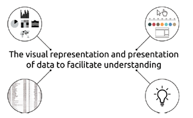
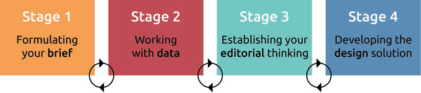
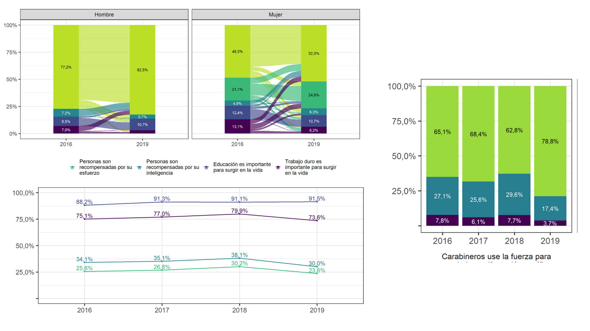
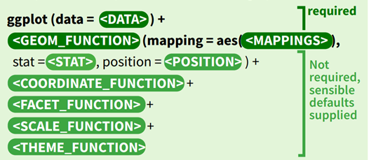

# Contenidos 

En este curso veremos: 

--

**Bloque 1**

1. ¿Por qué visualizamos datos?: Comprender la lógica de la visualización de datos longitudinales.

2. Tratamiento de base de datos: Preparar y depurar una base de datos longitudinales para el análisis.

--

**Bloque 2**

1. ¡A visualizar!: Graficar datos longitudinales en base a muestras complejas.

  * Gráficos de Barra
  * Gráficos de Puntos/Líneas
  * Gráficos Alluvial 
  
---
```{r setup, include=FALSE}
options(htmltools.dir.version = FALSE)
```
class: inverse middle right 

# 1. ¿Qué es la visualización de datos? 

---

<br>

*	“En términos simples, se trata de gráficos y el acto de seleccionar el gráfico correcto para mostrar las características de los datos que se cree que son más relevantes.” (Kirk, 2018, p.17) 

--

* Se debe ser fiel a los datos, por lo que es muy importante un **buen tratamiento de base de datos**.

--

* Por ende, los gráficos tienen que estar a merced de los datos.

--

```{r intro, echo=FALSE, fig.align='center', fig.height=1, out.height="70%", out.width="70%", fig.cap='A Definition for Data Visualisation. Fuente: Kirk (2018)'}

```

---
# 1.1. Fases de la Visualización de Datos.

```{r fases, echo=FALSE, fig.align='center', fig.height=1, out.height="80%", out.width="80%", fig.cap='The Four Stages of the Data Visualisation Design Process. Fuente: Kirk (2018)'}

```

1. **Formula tu plan de trabajo**: planifica, define e inicia tu proyecto.

--

2. **Trabajando con la base de datos**: produce, maneja y prepara tus datos.

--

3. **Establece tu pensamiento editorial**: define qué le mostrarás a tu audiencia.

---

# 1.2. Tablas VS Gráficos 
## ¿Por qué no ambos?

-	Ambas presentan objetivos totalmente distintos. Dependerá del contexto la elección de una de ellas. 

--

-	Cuando hacemos una tabla, hay que preguntarse ¿Cuánto tiempo tardé en encontrar los elementos importantes en ésta?

--

Bondades de los gráficos

--

-	Facilita el **entendimiento** de los datos, lo cual fomenta abrir la ciencia.

--

-	Tiene la capacidad de **resumir** datos, mostrando los elementos más relevantes.

--

-	Es **atractivo** y capta mejor la atención de los y las lectoras.

---

# 1.3. Visualizando datos longitudinales ELSOC


- Difícil representación de una gran cantidad de datos en tablas debido a la temporalidad de éstos. 

- Un adelanto de lo que veremos hoy:  

```{r graficos, echo=FALSE, fig.align='center', fig.height=1, out.height="80%", out.width="80%", fig.cap='ELSOC (2019). Resultados longitudinales 2016-2019'}

```

---

# 1.4. Cómo **NO** visualizar datos.

-	Más allá de lo estético, el error más grande que se puede cometer es la **mala representación de los datos**, lo que probablemente se debe a un mal manejo de la base de datos

--

-	Un ejemplo de esto es el gráfico ¿Crisis de fe en la democracia? (New York Times), que veremos a continuación. 

---
# ¿Crisis de la fe en la democracia?

```{r nyt, echo=FALSE, fig.align='center', fig.height=1, out.height="80%", out.width="80%", fig.cap=' A crisis of faith in democracy? (New York Times). Fuente: Healy (2018)'}
knitr::include_graphics("imagenes/nyt.png")
```

---

# Quizás no tanto...

```{r nyt_b, echo=FALSE, fig.align='center', fig.height=1, out.height="80%", out.width="80%", fig.cap='Perhaps the crisis has been overblown. (Erik Voeten). Fuente: Healy (2018)'}
knitr::include_graphics("imagenes/nyt_b.png")
```
---
class: inverse middle right

# 2. Uso de **ggplot2** y **tidyverse** 

---

<br>

-	Para la visualización de datos se utiliza el paquete `ggplot2`, el cual pertenece a `tidyverse`. Al igual que otros paquetes de R, presenta distintas funciones que van **desde el manejo de los datos hasta la estética en los gráficos**. 

--

```{r ggplot, echo=FALSE, fig.align='center', fig.height=1, out.height="80%", out.width="80%", fig.cap='Fuente: Cheat Sheet ggplot2'}

```

---

# 2.1. Componentes **ggplot2**

 
* Data [`data`]: Es la base donde se encontrarán los datos para la creación de los gráficos 

* Geometries [`geoms`]: Configura los elementos visuales de los gráficos. Puede modificar datos estadísticos y estética.

* Aesthetics [`aes`]: Se encarga de la estética del gráfico. Se puede cambiar lo colores, tamaños y formas. También, es posible hacer agrupaciones y editar la posición (x, y). 

* Stats [`stat`]: Se utiliza para hacer transformaciones estadísticas que nos permite comprender los datos.

---
<br>

* Position [`Position`]: Los ajustes de posición determinan cómo organizar [`geoms`].

* Coordinate systems [`coord`]: Modifica los ejes *x* e *y*. Si es que este no es modificado, por defecto se genera el plano cartesiano.

* Facetting [`facet`]: Sive para realizar conjuntos o sub - conjuntos de datos.

* Scale [`scale`]: Transforma valores de la base de datos a valores visuales con su respectiva estética.

* Themes [`theme`]: Controla la visualización de todos los elementos gráficos, a excepción de los datos. 

---
class: center, middle

# ¡Gracias!

1. Healy, K. (2018). *Data Visualization. A practical introduction.* 
[https://socviz.co/index.html](https://socviz.co/index.html)
2. Kirk, A. (2018). *Data Visualisation. A Handbook for Data Driven Design.* 